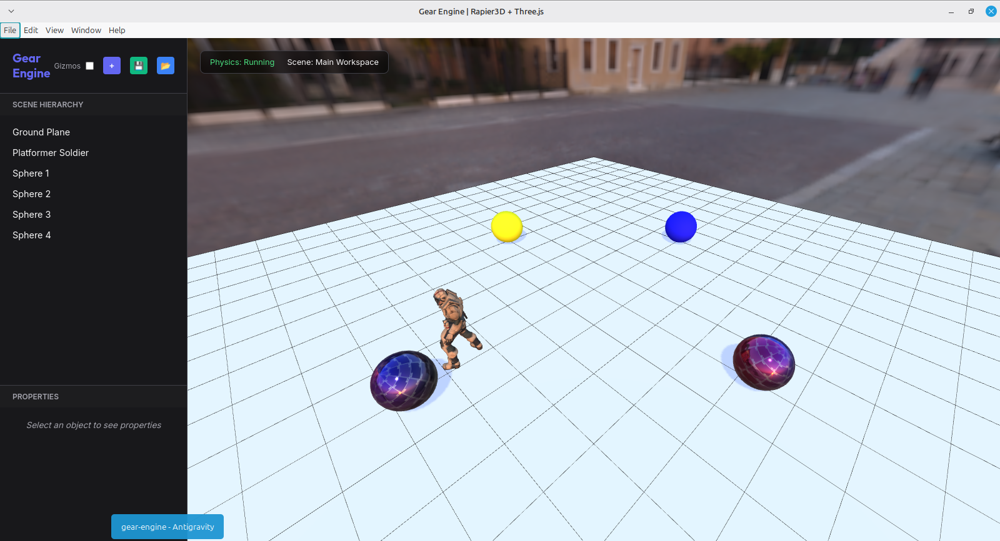

# ⚙️ Gear Engine Framework

<p align="center">
  
</p>

### *The Professional-Grade 3D Engine for AI-Driven World Building*

Gear Engine Framework is a lightweight, high-performance 3D engine built specifically to be controlled by AI agents. By decoupling the physics simulation and game logic into a Node.js REST API and the visualization into an Electron-based Three.js renderer, Gear Engine allows AI agents to architect, simulate, and preview complex 3D environments in real-time.

---

## 🚀 The Agentic Workflow
Unlike traditional engines, Gear Engine is designed to be "Agent-First":
1.  **Clone** the repository and install dependencies.
2.  **Drop** your 3D models and textures into the `/assets` folder.
3.  **Provide** the `skill.md` file to your AI agent.
4.  **Execute**: Let the AI agent build your game, place lights, configure materials, and attach scripts using purely RESTful commands.

---

## 🛠️ Quick Start Guide

### 1. Installation
Ensure you have Node.js installed, then clone the repo and install dependencies:
```bash
npm install
```

### 2. Launch the Engine
Start the Rapier3D server and the Electron-Three.js renderer:
```bash
npm start
```

### 3. Load the Test Scene
Once the application window appears:
1.  Locate the **Scene Manager** (📂) icon in the sidebar header.
2.  Select `platformer_scene.json` from the list.
3.  The engine will instantly restore the character, physics objects, materials, and follow-camera settings.

---

## 🧠 Key Features
- **Agentic Helper**: Integrated `/api/help` endpoint that delivers the full `skill.md` context to any connected AI.
- **Physics-Driven**: Every object is a physical entity managed by **Rapier3D**.
- **PBR-Ready**: Full support for Metallic/Roughness materials and Equirectangular HDR skyboxes.
- **Scripting Environment**: Attach custom `.js` logic to objects that runs in a secure VM context with full engine module access.
- **Persistent Worlds**: Robust scene export/load system that preserves every detail from lighting to camera offsets.

---

## 📂 Asset Management
All raw assets (GLB models, HDRs, textures, MP3s, and scripts) should be placed in the root `/assets` directory. The engine automatically serves these to the renderer and maps them to the internal material and audio systems.

---

## 🛠️ AI Development
To enable an AI agent to build your game, simply share the **`skill.md`** file located in the root directory. This file contains the complete API surface and usage examples required for the agent to take full control of the framework.

---

### Made with love by Jonathan Uwumugisha
*Empowering the next generation of AI-driven game development.*